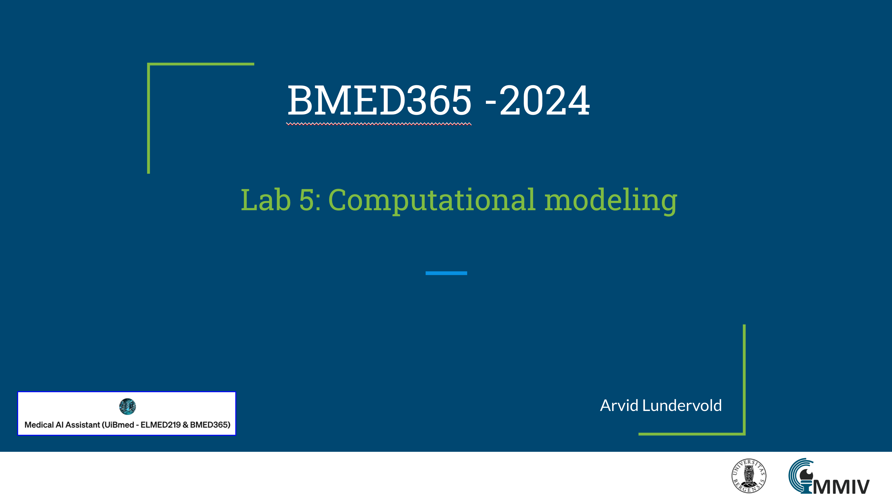

# Lab 5: Computational modeling

This lab is part of our journey through computational imaging and modeling techniques, and the use of AI in biomedical applications. It encompasses a broad set of methodologies to understand, analyze, and predict biological and medical phenomena through mathematical and computational means.  It also contains sections on [Outbreak science](./outbreak-science-extra) and [Programming for Computations - Python](./prog4comp-SL-HPL-extra) by the late Hans Petter Langtangen.   _update: 2024-02-21_

<!--   -->
 
If you have a subscription to [ChatGPT Plus](https://openai.com/blog/chatgpt-plus), you can also try out the the [**Medical AI Assistant (UiBmed - ELMED219 & BMED365)**](https://chat.openai.com/g/g-d90dfN17H-medical-ai-assistant-uibmed-elmed219-bmed365) [GPT](https://openai.com/blog/introducing-gpts) and see if you can get it to answer some of your questions.

---------------

## Slides

<!--

-->

------
## Notebooks

| Notebook    |      1-Click Notebook     
|:----------|------|
|  [01-perf-explore.ipynb](https://nbviewer.org/github/MMIV-ML/BMED365/blob/main/Lab5-Comp-Model/notebooks/01-perf-explore.ipynb)   Exploration of dynamic susceptibility contrast (DSC) MRI that allows clinicians to determine perfusion parameters in the brain, such as cerebral blood flow, cerebral blood volume, and mean transit time.| 
|  [02-SIR-model-explore.ipynb](https://nbviewer.org/github/MMIV-ML/BMED365/blob/main/Lab5-Comp-Model/notebooks/02-SIR-model-explore.ipynb)   Exploration of the SIR model in epidemiology (S=Susceptible, I=Infected, R=Recovered).| 
| [03-jupyter-ai-explore.ipynb](https://nbviewer.org/github/MMIV-ML/BMED365/blob/main/Lab5-Comp-Model/notebooks/03-jupyter-ai-explore.ipynb)   Jupyter AI is a generative AI extension for JupyterLab, designed to integrate generative AI models into Jupyter notebooks. It features an `%%ai` magic command for turning notebooks into generative AI playgrounds, supports a wide range of model providers (e.g., OpenAI, Hugging Face), and offers a native chat UI in JupyterLab for interactive AI assistance.| 

-----

<!--
## Learning motivations - watch these
(in the order of duration ...)
-->
