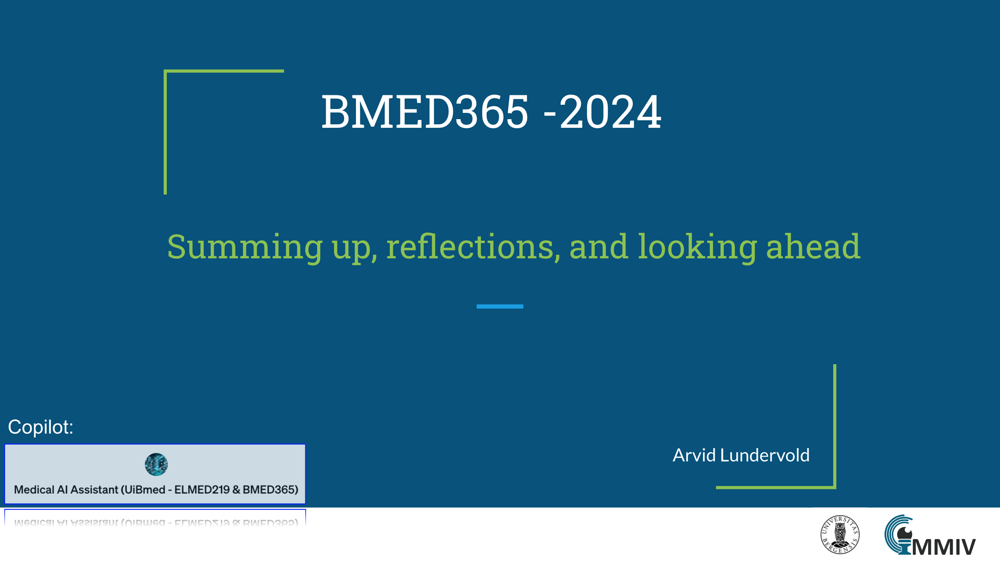

# Summing up, reflections, and looking ahead

 _update: 2024-02-23_

<!--   -->
 
If you have a subscription to [ChatGPT Plus](https://openai.com/blog/chatgpt-plus), you can also try out the the [**Medical AI Assistant (UiBmed - ELMED219 & BMED365)**](https://chat.openai.com/g/g-d90dfN17H-medical-ai-assistant-uibmed-elmed219-bmed365)   [GPT](https://openai.com/blog/introducing-gpts) and see if you can get it to answer some of your questions.

---------------

## Slides

<!--

-->
-----

### Reflections - watch or listen to these
(in the order of duration ...)

- **Podcast**: [Unconfuse Me](https://www.gatesnotes.com/Podcast) with Bill Gates - Episode 6 [Sam Altman](https://en.wikipedia.org/wiki/Sam_Altman), CEO OpenAI [[link](https://www.youtube.com/watch?v=PkXELH6Y2lM)]  (33:06 min)
- **Podcast**: [What's your problem](https://www.pushkin.fm/podcasts/whats-your-problem) with Jacob Goldstein - Using AI to Help Doctors Save Lives  (guest: _Suchi Saria, CEO of [Bayesian Health](https://www.bayesianhealth.com), and a professor at Johns Hopkins where she runs a lab focused on machine learning and healthcare_ ) [[link](https://www.pushkin.fm/podcasts/whats-your-problem/using-ai-to-help-doctors-save-lives)] (40:50 min)
  
### Readings:
(in the order of most recent ...)

- Schroff H et al. Live-cell imaging powered by computation. Nature Reviews Molecular Cell Biology, 2024. Review article published 20 Feb 2024 [[link](https://www.nature.com/articles/s41580-024-00702-6)]   _Discusses computational methods focusing on artificial intelligence-based approaches that can be layered on top of commonly used existing microscopies as well as hybrid methods that integrate computation and microscope hardware. Specifically, how computational approaches can improve the signal-to-noise ratio, spatial resolution, temporal resolution and multi-colour capacity of live-cell imaging._

- **Google**: Our next-generation model: Gemini 1.5 by Sundar Pichai, CEO Google and Alphabet & Demis Hassabis, CEO Google DeepMind [[link](https://blog.google/technology/ai/google-gemini-next-generation-model-february-2024)] (Feb 15, 2024)
  - A follow up by Simon Willison: [The killer app of Gemini Pro 1.5 is video](https://simonwillison.net/2024/Feb/21/gemini-pro-video)  ( _Some spectacular experiments_ ) see also his [repo](https://github.com/simonw) (Feb 21, 2024)
 
- Tu T et al. Towards conversational diagnostic AI. arXiv:2401.05654 2024. Preprint submitted 11 Jan 2024. [[link](https://arxiv.org/abs/2401.05654)]   _At the heart of medicine lies the physician-patient dialogue, where skillful history-taking paves the way for accurate diagnosis, effective management, and enduring trust. Artificial Intelligence (AI) systems capable of diagnostic dialogue could increase accessibility, consistency, and quality of care. However, approximating clinicians' expertise is an outstanding grand challenge. Here, researchers from Google Research and Google DeepMind introduce AMIE ([Articulate Medical Intelligence Explorer](https://blog.research.google/2024/01/amie-research-ai-system-for-diagnostic_12.html)), a Large Language Model (LLM) based AI system optimized for diagnostic dialogue._

  
### Repos:
- \# biomedical: [[Here](https://github.com/topics/biomedical)] are > 200 public GitHub repositories matching this topic...

- 
----

### UiB DIGI116 Medical Data Science (_Future Perspectives_)
recorded by A.L. 27 Sep 2023 in Łódź, Poland, with a gender-swapped, non-diegetic voice-over (w/ oldish instruction: "Next slide, please")

[UiB DIGI-courses Digital understanding, knowledge and competence](https://www.uib.no/en/digi) - [DIGI116](https://www4.uib.no/en/courses/DIGI116)

----

# Finale

We let the AI pioneer and ‘Godfather of AI’ [Geoffrey Hinton](https://en.wikipedia.org/wiki/Geoffrey_Hinton) have the last words in this course ...    

**Prof. Geoffrey Hinton - "Will digital intelligence replace biological intelligence?"** [Romanes Lecture 2024](https://www.ox.ac.uk/news/2024-02-20-romanes-lecture-godfather-ai-speaks-about-risks-artificial-intelligence)  given at the University of Oxford, 19 Feb 2024  [[video](https://youtu.be/N1TEjTeQeg0)] (36:54 min)

<!--
[https://www.youtube.com/watch?v=N1TEjTeQeg0](https://www.youtube.com/watch?v=N1TEjTeQeg0)

<iframe width="560" height="315" src="https://www.youtube.com/embed/N1TEjTeQeg0?si=2YCd4nlkL7sLMHkD" title="YouTube video player" frameborder="0" allow="accelerometer; autoplay; clipboard-write; encrypted-media; gyroscope; picture-in-picture; web-share" allowfullscreen></iframe>
-->
